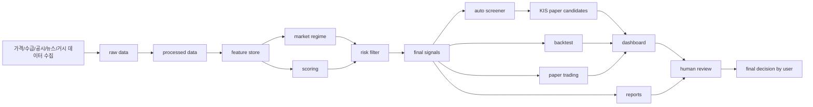

# KRX Alpha Platform

[](https://github.com/pkb0728-lgtm/krx-alpha-platform/actions/workflows/ci.yml)

한국 주식 데이터를 기반으로 **설명 가능한 투자 의사결정 보조 플랫폼**을 만드는 Python 프로젝트입니다.

이 프로젝트는 단순히 “내일 주가를 맞히는 예측기”가 아닙니다. 주가, 수급, 공시, 재무, 뉴스, 거시 환경 데이터를 수집하고, 데이터 품질을 확인한 뒤, 시장 상태와 종목별 신호를 분석해서 사람이 최종 판단할 수 있는 리포트와 대시보드를 제공합니다.

> 교육 및 포트폴리오 목적의 프로젝트입니다. 투자 조언이 아니며, 실제 매수/매도 판단은 반드시 사용자가 직접 검토해야 합니다.

## 한 줄 요약

```text
데이터 수집 -> ETL -> 피처 생성 -> 스코어링 -> 리스크 필터 -> 스크리닝 -> 백테스트/페이퍼트레이딩 -> 텔레그램/대시보드
```

## 현재 상태

| 항목 | 상태 |
| --- | --- |
| MVP 상태 | 로컬 PC에서 end-to-end 실행 가능한 1차 운영형 MVP 완성 |
| 핵심 명령어 | `python main.py run-daily-job ...` |
| KIS 연동 | 모의투자 토큰/잔고 조회 및 검토 후보 생성까지만 지원 |
| 실제 주문 | 현재 구현하지 않음. 실제 주문 API 호출 없음 |
| 대시보드 | Streamlit으로 유니버스, 스크리너, KIS 후보, 백테스트, 운영 상태 확인 |
| 알림 | Telegram dry-run 및 실제 전송 지원 |
| 테스트 | `pytest: 135 passed` |
| 품질 관리 | `ruff`, `mypy`, `pre-commit`, GitHub Actions CI |

## 빠른 실행

VSCode 터미널에서 가상환경을 켭니다.

```powershell
.\.venv\Scripts\Activate.ps1
```

하루 운영 흐름을 한 번에 실행합니다.

```powershell
python main.py run-daily-job --universe demo --start 2024-01-01 --end 2024-01-31 --kis-paper-candidates --telegram-dry-run
```

대시보드를 실행합니다.

```powershell
streamlit run src/krx_alpha/dashboard/app.py
```

브라우저에서 엽니다.

```text
http://localhost:8501
```

대시보드에서 먼저 볼 곳:

1. `Universe Ranking`
2. `Auto Screener`
3. `KIS Paper Review Candidates`
4. `Paper Portfolio`
5. `Operations Health`

## 이 프로젝트가 보여주는 역량

- Python 백엔드 개발
- 한국 주식 데이터 수집
- ETL 데이터 파이프라인 설계
- 데이터 품질 검증
- 데이터 계약(Data Contract) 구조
- Feature Store 구조
- 시장 국면(Market Regime) 분석
- 재무/공시/OpenDART 데이터 처리
- 외국인/기관 수급 분석
- 뉴스 감성 분석
- 거시경제 데이터 반영
- 설명 가능한 스코어링
- 리스크 필터링
- 자동 스크리너
- 백테스트 및 Walk-forward 검증
- 페이퍼트레이딩
- ML 학습 데이터셋 및 확률형 baseline 모델
- Drift Monitoring
- Experiment Tracking
- Telegram 알림
- Streamlit 대시보드
- Docker, CI/CD, 테스트, 타입체크, 린팅
- GitHub 포트폴리오 문서화

## 핵심 기능

### 1. 데이터 파이프라인

```text
raw -> processed -> features -> signals -> backtest
```

주요 저장 위치:

```text
data/raw/
data/processed/
data/features/
data/signals/
data/backtest/
```

### 2. 종목 분석 흐름

```text
가격/수급/재무/공시/뉴스/거시 데이터
-> 피처 생성
-> 시장 국면 분석
-> 종목 스코어링
-> 리스크 필터
-> 최종 신호 생성
-> 스크리너 후보 생성
-> 리포트/대시보드/텔레그램
```

### 3. KIS 모의투자 후보 생성

KIS 모의투자 계좌의 잔고를 조회한 뒤, 스크리너 결과와 결합해서 사람 검토용 후보를 만듭니다.

```powershell
python main.py build-kis-paper-candidates
```

중요:

- 실제 주문은 보내지 않습니다.
- `review_buy`, `review_add`, `hold_review`, `skip` 같은 검토 상태만 생성합니다.
- 결과는 `data/signals/kis_paper_candidates/`와 `reports/kis_paper_candidates/`에 저장됩니다.

### 4. 백테스트와 페이퍼트레이딩

```powershell
python main.py backtest-stock --ticker 005380 --start 2024-01-01 --end 2024-03-31
python main.py walk-forward-backtest --ticker 005380 --start 2024-01-01 --end 2024-03-31 --train-size 20 --test-size 5 --step-size 5
python main.py paper-trade-universe --universe demo --start 2024-01-01 --end 2024-03-31
```

백테스트는 거래비용과 슬리피지를 반영하며, Walk-forward 검증으로 특정 기간에만 맞는 전략인지 확인합니다.

### 5. 운영 상태 점검

```powershell
python main.py check-operations --skip-apis
python main.py check-apis --skip-pykrx --save
```

데이터 파일이 정상적으로 생성됐는지, 오래된 산출물이 없는지, API 설정이 빠지지 않았는지 확인합니다.

## 주요 산출물

| 산출물 | 경로 |
| --- | --- |
| 유니버스 요약 | `data/signals/universe_summary_daily/` |
| 자동 스크리너 | `data/signals/screening_daily/` |
| KIS 모의투자 후보 | `data/signals/kis_paper_candidates/` |
| 페이퍼 포트폴리오 | `data/backtest/paper_portfolio_summary/` |
| 백테스트 결과 | `data/backtest/metrics/` |
| ML 결과 | `data/signals/ml_metrics/` |
| 운영 상태 | `data/signals/operations_health/` |
| 리포트 | `reports/` |
| 실험 로그 | `experiments/experiment_log.csv` |

## 프로젝트 구조

```text
src/krx_alpha/
  collectors/    데이터 수집
  processors/    raw -> processed 변환
  features/      피처 생성
  regime/        시장 국면 분석
  scoring/       설명 가능한 점수화
  risk/          리스크 필터
  signals/       최종 신호 생성
  screening/     자동 스크리너
  broker/        KIS 모의투자 연동
  backtest/      백테스트
  paper_trading/ 페이퍼트레이딩
  experiments/   실험 로그
  monitoring/    데이터/성능/운영 모니터링
  reports/       Markdown 리포트
  dashboard/     Streamlit 대시보드
  scheduler/     daily job 실행기
  pipelines/     단일 종목/유니버스 파이프라인
  contracts/     데이터 계약
  database/      저장 경로 및 I/O
  configs/       환경설정
  utils/         로깅/공통 유틸
```

## 아키텍처



## 설치 방법

처음 클론한 경우:

```powershell
py -3.11 -m venv .venv
.\.venv\Scripts\Activate.ps1
python -m pip install --upgrade pip
python -m pip install -e ".[data,dashboard,dev]"
```

환경 확인:

```powershell
python main.py doctor
pytest
```

## 환경 변수

실제 API 키는 `.env`에만 저장하고 GitHub에 올리지 않습니다.

예시는 `.env.example`을 참고합니다.

주요 환경 변수:

```text
DART_API_KEY
NAVER_CLIENT_ID
NAVER_CLIENT_SECRET
GEMINI_API_KEY
TELEGRAM_BOT_TOKEN
TELEGRAM_CHAT_ID
KIS_APP_KEY
KIS_APP_SECRET
KIS_ACCOUNT_NO
FRED_API_KEY
```

KIS 계좌번호 형식:

```text
KIS_ACCOUNT_NO=12345678-01
```

## 품질 확인

```powershell
ruff check .
mypy src
pytest
```

현재 검증 결과:

```text
pytest: 135 passed
ruff: all checks passed
mypy: no issues found
```

## 문서

한국어 문서:

- [한국어 운영 Runbook](docs/operations-runbook-ko.md)
- [사용 가이드](docs/usage.md)
- [포트폴리오 리뷰 가이드](docs/portfolio-review-guide.md)

영어/상세 문서:

- [Operations Runbook](docs/operations-runbook.md)
- [Architecture](docs/architecture.md)
- [Data Design](docs/data-design.md)
- [Scoring And Risk](docs/scoring-and-risk.md)
- [Security](docs/security.md)
- [Troubleshooting](docs/troubleshooting.md)
- [ADR 0001](docs/adr/0001-mvp-scope.md)

## 프로젝트 간단 요약

짧게는 이렇게 설명할 수 있습니다.

```text
이 프로젝트는 한국 주식 데이터를 수집하고 검증한 뒤,
기술적 지표, 재무, 공시, 수급, 뉴스, 거시 데이터를 함께 반영해
설명 가능한 투자 검토 후보를 생성하는 운영형 데이터 플랫폼입니다.
실제 주문은 보내지 않고, 사람이 최종 판단하도록 설계했습니다.
```

강조 포인트:

- 예측 모델 하나가 아니라 운영 가능한 데이터 플랫폼입니다.
- 데이터 계층과 데이터 계약을 둬서 재현성을 높였습니다.
- 신호 생성 전에 리스크 필터를 적용합니다.
- 백테스트와 Walk-forward로 신호를 검증합니다.
- Telegram, Streamlit, daily job으로 운영 흐름을 만들었습니다.
- API 키와 실제 주문 기능은 안전하게 분리했습니다.

## 로드맵

- KOSPI200/KOSDAQ150 유니버스 자동 구성
- 더 긴 기간의 백테스트와 포트폴리오 제약
- DART 공시 발생일 기반 point-in-time 처리 강화
- 시장 지수 기반 regime 분석 개선
- ML baseline의 Walk-forward 검증
- MLflow 기반 실험 추적 확장
- Drift 알림 정책 고도화
- APScheduler 기반 장기 실행 모드
- Docker Compose 대시보드 profile 추가

## 안전 고지

이 프로젝트는 투자 판단을 보조하기 위한 도구입니다. 자동 매매 시스템이 아니며, 현재 구현은 실제 주문을 보내지 않습니다. 모든 투자 판단은 사용자가 직접 검토해야 합니다.
