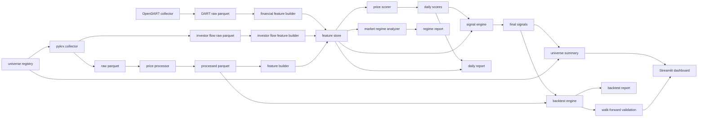

# KRX Alpha Platform

Explainable Korean stock investment decision-support platform built with Python.

This project is not a simple stock price prediction script. It is a small but
operational financial data platform that demonstrates data collection, ETL,
OpenDART financial/disclosure ingestion, data validation, feature engineering,
financial feature scoring, disclosure event risk scoring, investor flow
scoring, market regime analysis, explainable scoring, risk filtering,
backtesting, report generation, and a Streamlit dashboard.

> This project is for education and portfolio review. It is not investment advice.

## What This Project Shows

- Python backend development with a modular `src/` layout
- Korean stock data collection with `pykrx`
- OpenDART company, financial statement, and disclosure collectors
- ETL data layers: `raw`, `processed`, `features`, `signals`, `backtest`
- Data contracts and validation checks
- Named universe management for repeatable screening
- Technical and financial feature engineering
- Disclosure event feature engineering
- Foreign/institution investor flow feature engineering
- Market regime analysis connected to risk filtering
- Explainable rule-based scoring
- Risk filtering before final signals
- Simple signal backtesting with costs and slippage
- Walk-forward validation for signal robustness review
- Markdown reports for single-stock and universe screening
- Streamlit dashboard for universe, report, backtest, and walk-forward review
- Tests, linting, type checking, Docker, and GitHub Actions

## Current MVP

The current MVP supports this end-to-end flow:

```text
select named universe
-> collect price data
-> collect investor flow data
-> collect OpenDART company/financial/disclosure data
-> process raw data
-> build price features
-> build investor flow features
-> build OpenDART financial features
-> build OpenDART disclosure event features
-> analyze market regime
-> score each stock
   using technical + risk + financial + event + flow evidence
-> apply risk filters
-> generate final signals
-> backtest buy-candidate signals
-> validate signals with walk-forward folds
-> generate Markdown reports
-> view results in Streamlit
```

Example universe result:

```text
Ticker  Action         Confidence
005380  buy_candidate  72.83
005930  watch          63.78
000660  watch          59.37
```

## Architecture



## Project Structure

```text
src/krx_alpha/
  collectors/    data collection
  processors/    raw to processed ETL
  features/      feature engineering
  regime/        market regime analysis
  scoring/       explainable scoring
  risk/          risk filters
  signals/       final signal generation
  backtest/      signal backtesting
  universe/      named universe definitions
  reports/       Markdown report generation
  dashboard/     Streamlit dashboard
  pipelines/     single-stock and universe pipelines
  contracts/     dataset validation rules
  database/      file paths and storage helpers
  configs/       environment settings
  utils/         logging and utilities
```

## Quick Start

Use PowerShell in VSCode.

```powershell
cd C:\Users\USER\Documents\Codex\2026-05-13\role-python-mlops-github-vscode-python
.\.venv\Scripts\Activate.ps1
python main.py doctor
```

If you start from a fresh clone:

```powershell
py -3.11 -m venv .venv
.\.venv\Scripts\Activate.ps1
python -m pip install --upgrade pip
python -m pip install -e ".[data,dashboard,dev]"
```

## Run The Pipeline

Single stock:

```powershell
python main.py run-pipeline --ticker 005930 --start 2024-01-01 --end 2024-01-31
```

OpenDART demo data:

```powershell
python main.py collect-dart-company --ticker 005930 --demo
python main.py collect-dart-financials --ticker 005930 --year 2023 --report-code 11011 --demo
python main.py build-dart-financial-features --ticker 005930 --year 2023 --report-code 11011
python main.py collect-dart-disclosures --ticker 005930 --start 2024-01-01 --end 2024-01-31 --demo
python main.py build-dart-disclosure-events --ticker 005930 --start 2024-01-01 --end 2024-01-31
```

Investor flow demo data:

```powershell
python main.py collect-investor-flow --ticker 005930 --start 2024-01-01 --end 2024-01-31 --demo
python main.py build-investor-flow-features --ticker 005930 --start 2024-01-01 --end 2024-01-31
```

Blend OpenDART financial, disclosure event, and investor flow scores:

```powershell
python main.py run-pipeline --ticker 005930 --start 2024-01-01 --end 2024-01-31 --financial-year 2023 --event-start 2024-01-01 --event-end 2024-01-31 --flow-start 2024-01-01 --flow-end 2024-01-31
```

Multiple stocks:

```powershell
python main.py list-universe --universe all
python main.py list-universe --universe demo
python main.py run-universe --universe demo --start 2024-01-01 --end 2024-01-31
python main.py generate-universe-report --start 2024-01-01 --end 2024-01-31
```

Manual tickers are still supported:

```powershell
python main.py run-universe --tickers 005930,000660,005380 --start 2024-01-01 --end 2024-01-31
```

Backtest one stock after running its pipeline:

```powershell
python main.py analyze-regime --ticker 005380 --start 2024-01-01 --end 2024-03-31
python main.py backtest-stock --ticker 005380 --start 2024-01-01 --end 2024-03-31
python main.py walk-forward-backtest --ticker 005380 --start 2024-01-01 --end 2024-03-31 --train-size 20 --test-size 5 --step-size 5
```

Dashboard:

```powershell
streamlit run src/krx_alpha/dashboard/app.py
```

Open:

```text
http://localhost:8501
```

## Quality Checks

```powershell
ruff check .
mypy src
pytest
```

Current verified result:

```text
pytest: 53 passed
ruff: all checks passed
mypy: no issues found
```

## Data Outputs

```text
data/raw/prices_daily/
data/raw/dart_company/
data/raw/dart_financials/
data/raw/dart_disclosures/
data/raw/investor_flow_daily/
data/processed/universe/
data/processed/prices_daily/
data/features/prices_daily/
data/features/dart_financials/
data/features/dart_disclosure_events/
data/features/investor_flow_daily/
data/signals/scores_daily/
data/signals/final_signals_daily/
data/signals/market_regime_daily/
data/signals/universe_summary_daily/
data/backtest/trades/
data/backtest/metrics/
data/backtest/walk_forward_folds/
data/backtest/walk_forward_summary/
reports/daily/
reports/regime/
reports/universe/
reports/backtest/
```

## Documentation

- [Architecture](docs/architecture.md)
- [Usage Guide](docs/usage.md)
- [Data Design](docs/data-design.md)
- [DART Data Card](docs/data_cards/dart_data_v0.md)
- [Investor Flow Data Card](docs/data_cards/investor_flow_data_v0.md)
- [Scoring and Risk](docs/scoring-and-risk.md)
- [Result Example](docs/results-example.md)
- [Troubleshooting](docs/troubleshooting.md)
- [Security](docs/security.md)
- [Portfolio Review Guide](docs/portfolio-review-guide.md)
- [ADR 0001: MVP Scope](docs/adr/0001-mvp-scope.md)

## Security

Do not commit real API keys. Use `.env` locally and keep `.env.example` as the
only committed environment file.

## Roadmap

- Add dynamic KOSPI200/KOSDAQ150 universe collectors and liquidity filters
- Add stricter point-in-time release-date handling for DART financial and event data
- Add short-selling features
- Calibrate market regime thresholds with longer validation windows
- Expand backtesting with portfolio-level constraints
- Add ML baselines with walk-forward validation
- Add MLflow experiment tracking
- Add Telegram daily notifications
- Add Docker Compose dashboard profile
