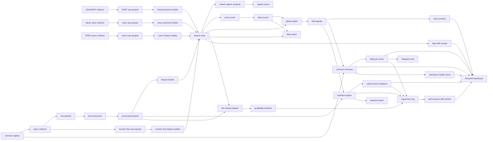

# KRX Alpha Platform

Explainable Korean stock investment decision-support platform built with Python.

This project is not a simple stock price prediction script. It is a small but
operational financial data platform that demonstrates data collection, ETL,
OpenDART financial/disclosure ingestion, data validation, feature engineering,
financial feature scoring, disclosure event risk scoring, investor flow
scoring, Naver news collection, Gemini-compatible news sentiment scoring,
FRED macro environment scoring, market regime analysis, explainable scoring, risk filtering, paper trading, backtesting,
experiment tracking, drift monitoring, report generation, scheduled daily jobs,
ML training dataset generation, a first explainable ML probability baseline,
operations health checks, Telegram alerts, and a Streamlit dashboard.

> This project is for education and portfolio review. It is not investment advice.

## What This Project Shows

- Python backend development with a modular `src/` layout
- Korean stock data collection with `pykrx`
- OpenDART company, financial statement, and disclosure collectors
- ETL data layers: `raw`, `processed`, `features`, `signals`, `backtest`
- Data contracts, validation checks, and automated price data quality reports
- Named universe management for repeatable screening
- Auto screener that creates a human-review shortlist from final signals
- Technical and financial feature engineering
- Disclosure event feature engineering
- Foreign/institution investor flow feature engineering
- Naver news collection and rule/Gemini-based news sentiment features
- FRED macro features for US rates and USD/KRW risk context
- Market regime analysis connected to risk filtering
- Explainable rule-based scoring
- Risk filtering before final signals
- Paper trading mode that creates virtual fills, positions, and reports without broker orders
- Simple signal backtesting with costs and slippage
- Walk-forward validation for signal robustness review
- Leakage-aware ML training dataset generation for probability models
- Explainable ML probability baseline without heavyweight dependencies
- CSV-based experiment tracking for backtest and operations runs
- Data drift and performance drift monitoring
- Operations health checks for local artifacts and optional API connectivity
- Markdown reports for single-stock and universe screening, including candidate review cards
- Daily job runner for after-market operations
- Telegram daily brief with drift and operations health status preview, send command, and retry settings
- Streamlit dashboard for universe, screening, KIS paper candidates, news sentiment, macro, report, backtest, walk-forward, ML, drift, and operations review
- Tests, linting, type checking, Docker, and GitHub Actions

## Current MVP

The current MVP supports this end-to-end flow:

```text
select named universe
-> collect price data
-> collect investor flow data
-> collect OpenDART company/financial/disclosure data
-> process raw data
-> build price features
-> build investor flow features
-> build OpenDART financial features
-> build OpenDART disclosure event features
-> collect news and build news sentiment features
-> collect FRED macro data and build macro features
-> analyze market regime
-> score each stock
   using technical + risk + financial + event + flow + news + macro evidence
-> apply risk filters
-> generate final signals
-> create auto screener shortlist
-> simulate paper-only fills and portfolio state
-> aggregate paper-only portfolio results across a universe
-> backtest buy-candidate signals
-> validate signals with walk-forward folds
-> build leakage-aware ML training dataset
-> train first probability baseline
-> log experiment metrics
-> detect data/performance drift
-> check operations health
-> generate Markdown reports
-> run daily scheduled job
-> send or preview Telegram daily brief
-> view results in Streamlit
```

Example universe result:

```text
Ticker  Action         Confidence
005380  buy_candidate  72.83
005930  watch          63.78
000660  watch          59.37
```

## Architecture



## Project Structure

```text
src/krx_alpha/
  collectors/    data collection
  processors/    raw to processed ETL
  features/      feature engineering
  regime/        market regime analysis
  scoring/       explainable scoring
  risk/          risk filters
  signals/       final signal generation
  screening/     human-review shortlist generation
  backtest/      signal backtesting
  experiments/   CSV experiment tracking
  monitoring/    data, performance drift, and operations health checks
  universe/      named universe definitions
  reports/       Markdown report generation
  dashboard/     Streamlit dashboard
  scheduler/     after-market daily job orchestration
  pipelines/     single-stock and universe pipelines
  contracts/     dataset validation rules
  database/      file paths and storage helpers
  configs/       environment settings
  utils/         logging and utilities
```

## Quick Start

Use PowerShell in VSCode.

```powershell
cd C:\Users\USER\Documents\Codex\2026-05-13\role-python-mlops-github-vscode-python
.\.venv\Scripts\Activate.ps1
python main.py doctor
```

If you start from a fresh clone:

```powershell
py -3.11 -m venv .venv
.\.venv\Scripts\Activate.ps1
python -m pip install --upgrade pip
python -m pip install -e ".[data,dashboard,dev]"
```

## Run The Pipeline

Single stock:

```powershell
python main.py run-pipeline --ticker 005930 --start 2024-01-01 --end 2024-01-31
```

OpenDART demo data:

```powershell
python main.py collect-dart-company --ticker 005930 --demo
python main.py collect-dart-financials --ticker 005930 --year 2023 --report-code 11011 --demo
python main.py build-dart-financial-features --ticker 005930 --year 2023 --report-code 11011
python main.py collect-dart-disclosures --ticker 005930 --start 2024-01-01 --end 2024-01-31 --demo
python main.py build-dart-disclosure-events --ticker 005930 --start 2024-01-01 --end 2024-01-31
```

Investor flow demo data:

```powershell
python main.py collect-investor-flow --ticker 005930 --start 2024-01-01 --end 2024-01-31 --demo
python main.py build-investor-flow-features --ticker 005930 --start 2024-01-01 --end 2024-01-31
```

News sentiment demo data:

```powershell
python main.py collect-news --ticker 005930 --start 2024-01-01 --end 2024-01-31 --demo
python main.py build-news-sentiment --ticker 005930 --start 2024-01-01 --end 2024-01-31 --rule-based
```

Use `--gemini` after `GEMINI_API_KEY` is configured to request Gemini-based
news summarization and sentiment scoring. The default `--rule-based` path is
deterministic and works offline for demos.

Macro/FRED demo data:

```powershell
python main.py collect-macro --start 2024-01-01 --end 2024-01-31 --demo
python main.py build-macro-features --start 2024-01-01 --end 2024-01-31
```

Use `--live` after `FRED_API_KEY` is configured to collect real FRED series.
The default series are `DGS10`, `DFF`, and `DEXKOUS`, covering US 10-year
yields, the effective federal funds rate, and USD/KRW.

Blend OpenDART financial, disclosure event, investor flow, news, and macro scores:

```powershell
python main.py run-pipeline --ticker 005930 --start 2024-01-01 --end 2024-01-31 --financial-year 2023 --event-start 2024-01-01 --event-end 2024-01-31 --flow-start 2024-01-01 --flow-end 2024-01-31 --news-start 2024-01-01 --news-end 2024-01-31 --macro-start 2024-01-01 --macro-end 2024-01-31
```

Multiple stocks:

```powershell
python main.py list-universe --universe all
python main.py list-universe --universe demo
python main.py run-universe --universe demo --start 2024-01-01 --end 2024-01-31
python main.py screen-universe
python main.py generate-universe-report --start 2024-01-01 --end 2024-01-31
```

Manual tickers are still supported:

```powershell
python main.py run-universe --tickers 005930,000660,005380 --start 2024-01-01 --end 2024-01-31
```

Backtest one stock after running its pipeline:

```powershell
python main.py analyze-regime --ticker 005380 --start 2024-01-01 --end 2024-03-31
python main.py paper-trade --ticker 005380 --start 2024-01-01 --end 2024-03-31
python main.py paper-trade-universe --universe demo --start 2024-01-01 --end 2024-03-31
python main.py backtest-stock --ticker 005380 --start 2024-01-01 --end 2024-03-31
python main.py walk-forward-backtest --ticker 005380 --start 2024-01-01 --end 2024-03-31 --train-size 20 --test-size 5 --step-size 5
```

`paper-trade` and `paper-trade-universe` are paper mode only. They read local
final signal files and processed prices, then write virtual ledger, position,
summary, and report artifacts. They never call a broker API and never send real
orders.

Leakage-aware ML dataset for future probability models:

```powershell
python main.py build-ml-dataset --ticker 005380 --start 2024-01-01 --end 2024-03-31 --holding-days 5
python main.py train-ml-baseline --ticker 005380 --start 2024-01-01 --end 2024-03-31 --holding-days 5
```

Dashboard:

```powershell
streamlit run src/krx_alpha/dashboard/app.py
```

The dashboard includes the latest auto screener shortlist, candidate review cards,
priority/status filters, paper portfolio snapshot, paper portfolio history view
built from saved `paper_portfolio_summary` files, latest API health result, and
latest operations health result when available.

Open:

```text
http://localhost:8501
```

Telegram daily brief preview:

```powershell
python main.py send-telegram-daily --dry-run
```

The daily brief includes universe ranking, paper portfolio, latest backtest,
walk-forward, drift, and operations health summaries when those artifacts are
available.

After setting `TELEGRAM_BOT_TOKEN` and `TELEGRAM_CHAT_ID` in `.env`, send it:

```powershell
python main.py send-telegram-daily --send
```

Optional Telegram operations settings:

```text
TELEGRAM_TIMEOUT_SECONDS=10
TELEGRAM_MAX_RETRIES=2
TELEGRAM_RETRY_SLEEP_SECONDS=1
```

After-market daily job:

```powershell
python main.py run-daily-job --universe demo --start 2024-01-01 --end 2024-01-31 --telegram-dry-run
```

The daily job runs the universe pipeline, generates the universe report, builds
the auto-screener shortlist, runs paper portfolio simulation, refreshes
operations health, and builds the Telegram brief. Use `--no-screening` or
`--no-paper-trading` if you want to skip either optional step. With Telegram
credentials configured, use `--telegram-send` for real delivery.
Add `--kis-paper-candidates` when you want the same run to query the KIS
mock-investment balance and write paper review candidates without sending
orders.
When a collection API is temporarily unavailable, the universe step can reuse
same-period cached final signals and records the original failure in the
summary `error` column.

Recent experiment log:

```powershell
python main.py show-experiments --limit 10
```

Drift monitoring and review:

```powershell
python main.py check-price-quality --input-path data/processed/prices_daily/005930_20240101_20240131.parquet
python main.py detect-performance-drift --run-type backtest --metric cumulative_return --baseline-window 1 --recent-window 1
python main.py detect-data-drift --reference-path data/features/prices_daily/005930_20240101_20240131.parquet --current-path data/features/prices_daily/005380_20240101_20240131.parquet --columns rsi_14,volatility_5d,trading_value_change_5d
python main.py send-telegram-daily --dry-run
```

Operations health review:

```powershell
python main.py check-apis --skip-pykrx --save
python main.py kis-paper-token-check
python main.py kis-paper-balance
python main.py build-kis-paper-candidates
python main.py check-operations --skip-apis
python main.py check-operations --include-apis --skip-pykrx
```

`build-kis-paper-candidates` combines the latest auto-screener result with the
KIS mock-investment balance and writes a human-review candidate file. It does
not call any KIS order endpoint.

## Quality Checks

```powershell
ruff check .
mypy src
pytest
```

Current verified result:

```text
pytest: 135 passed
ruff: all checks passed
mypy: no issues found
```

## Data Outputs

```text
data/raw/prices_daily/
data/raw/dart_company/
data/raw/dart_financials/
data/raw/dart_disclosures/
data/raw/investor_flow_daily/
data/raw/macro_fred_daily/
data/processed/universe/
data/processed/prices_daily/
data/features/prices_daily/
data/features/dart_financials/
data/features/dart_disclosure_events/
data/features/investor_flow_daily/
data/features/macro_fred_daily/
data/features/ml_training/
data/signals/scores_daily/
data/signals/final_signals_daily/
data/signals/market_regime_daily/
data/signals/universe_summary_daily/
data/signals/screening_daily/
data/signals/ml_predictions/
data/signals/ml_metrics/
data/signals/drift/
data/signals/operations_health/
data/backtest/trades/
data/backtest/metrics/
data/backtest/paper_trade_ledger/
data/backtest/paper_positions/
data/backtest/paper_summary/
data/backtest/paper_portfolio_trade_ledger/
data/backtest/paper_portfolio_positions/
data/backtest/paper_portfolio_summary/
data/backtest/walk_forward_folds/
data/backtest/walk_forward_summary/
experiments/experiment_log.csv
reports/daily/
reports/regime/
reports/universe/
reports/screening/
reports/backtest/
reports/paper_trading/
reports/modeling/
reports/monitoring/
```

## Documentation

- [Architecture](docs/architecture.md)
- [Usage Guide](docs/usage.md)
- [Data Design](docs/data-design.md)
- [DART Data Card](docs/data_cards/dart_data_v0.md)
- [Investor Flow Data Card](docs/data_cards/investor_flow_data_v0.md)
- [Macro/FRED Data Card](docs/data_cards/macro_data_v0.md)
- [ML Dataset Card](docs/model_cards/ml_training_dataset_v0.md)
- [ML Baseline Model Card](docs/model_cards/scorecard_probability_baseline_v0.md)
- [Scoring and Risk](docs/scoring-and-risk.md)
- [Result Example](docs/results-example.md)
- [Troubleshooting](docs/troubleshooting.md)
- [Security](docs/security.md)
- [Portfolio Review Guide](docs/portfolio-review-guide.md)
- [ADR 0001: MVP Scope](docs/adr/0001-mvp-scope.md)

## Security

Do not commit real API keys. Use `.env` locally and keep `.env.example` as the
only committed environment file.

## Roadmap

- Add dynamic KOSPI200/KOSDAQ150 universe collectors and liquidity filters
- Add stricter point-in-time release-date handling for DART financial and event data
- Add short-selling features
- Calibrate market regime thresholds with longer validation windows
- Expand backtesting with portfolio-level constraints
- Upgrade ML baseline to walk-forward model validation
- Add MLflow experiment tracking on top of the CSV experiment log
- Add richer drift thresholds and scheduled Telegram warning policies
- Add APScheduler long-running daemon mode
- Add Docker Compose dashboard profile
