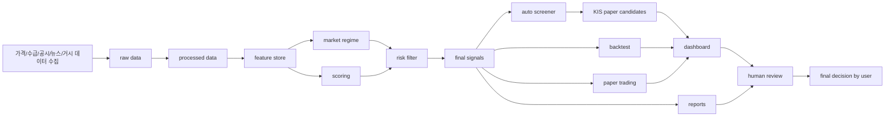

# KRX Alpha Platform

[](https://github.com/pkb0728-lgtm/krx-alpha-platform/actions/workflows/ci.yml)

한국 주식 데이터를 기반으로 **설명 가능한 투자 의사결정 보조 플랫폼**을 만드는 Python 프로젝트입니다.

이 프로젝트는 단순히 “내일 주가를 맞히는 예측기”가 아닙니다. 주가, 수급, 공시, 재무, 뉴스, 거시 환경 데이터를 수집하고, 데이터 품질을 확인한 뒤, 시장 상태와 종목별 신호를 분석해서 사람이 최종 판단할 수 있는 리포트와 대시보드를 제공합니다.

> 교육 및 포트폴리오 목적의 프로젝트입니다. 투자 조언이 아니며, 실제 매수/매도 판단은 반드시 사용자가 직접 검토해야 합니다.

## 한 줄 요약

```text
데이터 수집 -> ETL -> 피처 생성 -> 스코어링 -> 리스크 필터 -> 스크리닝 -> 백테스트/페이퍼트레이딩 -> 텔레그램/대시보드
```

## 현재 상태

| 항목 | 상태 |
| --- | --- |
| MVP 상태 | 로컬 PC에서 end-to-end 실행 가능한 1차 운영형 MVP 완성 |
| 핵심 명령어 | `python main.py run-daily-job ...` |
| 단일 종목 분석 | 회사명 또는 종목코드로 상세 분석 가능: `python main.py analyze-stock 삼성전자 --lookback-days 180` |
| KIS 연동 | 모의투자 토큰/잔고 조회 및 검토 후보 생성까지만 지원 |
| 실제 주문 | 구현하지 않음. 수동 검토용 주문 계획표만 생성 |
| 대시보드 | Streamlit으로 유니버스, 스크리너, KIS 후보, 판단 성과 추적, 백테스트, 운영 상태 확인 |
| 알림 | Telegram dry-run 및 실제 전송 지원, 한국어 일일 요약 |
| 테스트 | `pytest` 전체 통과 |
| 품질 관리 | `ruff`, `mypy`, `pre-commit`, GitHub Actions CI |

## 빠른 실행

VSCode 터미널에서 가상환경을 켭니다.

```powershell
.\.venv\Scripts\Activate.ps1
```

하루 운영 흐름을 한 번에 실행합니다.

```powershell
python main.py run-daily-job --universe large_cap --lookback-days 180 --kis-paper-candidates --telegram-send
```

이 명령은 유니버스 분석뿐 아니라 대시보드에서 사용하는 같은 기간의
거시환경, 백테스트, 페이퍼 포트폴리오, 워크포워드, ML 확률 베이스라인
자료도 함께 갱신합니다. 특정 종목 기준으로 검증 자료를 만들고 싶으면
`--dashboard-artifact-ticker 005930`처럼 종목코드를 지정할 수 있습니다.
뉴스와 거시환경 피처도 먼저 생성해서 종목 점수의 `News`, `Macro` 항목에
반영합니다. 빠른 점검만 하고 싶으면 `--no-score-external-features`를 붙이면
됩니다.

이 명령은 분석 결과를 자동으로 `decision_journal`에 누적 저장하고,
대시보드의 과거 판단 성과 평가 파일도 함께 갱신합니다. 오늘 판단처럼
아직 비교 기준일이 지나지 않은 행은 `평가 대기`로 표시됩니다.
다른 보유일 기준으로 다시 비교하고 싶으면:

```powershell
python main.py evaluate-decision-journal --holding-days 5
```

평가가 생성되면 대시보드의 `과거 판단 성과 평가` 섹션에서 전체 기록,
평가 완료/대기 건수, 평균 실제 수익률, 유리한 결과 비율을 확인할 수 있습니다.

관심 종목 하나만 빠르게 보고 싶으면 회사명을 그대로 입력할 수 있습니다.

```powershell
python main.py analyze-stock 삼성전자 --lookback-days 180
python main.py analyze-stock 삼성전자 --lookback-days 180 --telegram-dry-run
python main.py analyze-stock 삼성전자 --lookback-days 180 --telegram-send
```

이 명령은 회사명을 종목코드로 바꾼 뒤 단일 종목 분석을 실행하고,
한눈에 보는 결론, 점수 분해, 가격/기술 지표, 판단 근거, 초보자용 해석
메모를 한국어 표로 보여줍니다. 분석 전용 기능이며 실제 주문은 보내지
않습니다. `--telegram-dry-run`은 텔레그램 전송 전 미리보기이고,
`--telegram-send`는 분석 결과 전체를 텔레그램으로 전송합니다. 텔레그램
길이 제한을 넘으면 내용을 요약하지 않고 여러 메시지로 나누어 보냅니다.

텔레그램 전송 없이 미리보기만 하려면:

```powershell
python main.py run-daily-job --universe large_cap --lookback-days 180 --kis-paper-candidates --telegram-dry-run
```

대시보드를 실행합니다.

```powershell
streamlit run src/krx_alpha/dashboard/app.py
```

브라우저에서 엽니다.

```text
http://localhost:8501
```

대시보드에서 먼저 볼 곳:

1. `오늘 결론부터 보기`
2. `과거 판단 성과 평가`
3. `유니버스 순위`
4. `자동 스크리너`
5. `KIS 모의투자 검토 후보`
6. `페이퍼 포트폴리오`
7. `워크포워드 검증`
8. `운영 상태`

스크리너 통과 종목이 0개여도 오류가 아닐 수 있습니다. 점수, 신뢰도,
리스크 기준을 모두 만족한 종목이 없으면 프로그램은 보수적으로 후보를
만들지 않습니다.

페이퍼 포트폴리오와 워크포워드 섹션에는 검산표가 포함됩니다. 거래 수는
실제 체결 거래장 또는 구간별 `trade_count` 합계로 확인하고, 최종
평가금액은 `현금 + 보유 주식 평가금액`으로 확인합니다. KIS 모의투자
계좌의 총평가금액은 증권사 모의계좌 조회값이며, 페이퍼 포트폴리오의
가상 시작금액과는 별개입니다.

## 포트폴리오 제출 요약

이 저장소는 단순 주가 예측 스크립트가 아니라, 장 마감 후 한 번 실행해서
분석 결과를 생성하는 **운영형 금융 데이터 분석 플랫폼 MVP**입니다.

면접이나 포트폴리오 리뷰에서는 아래 흐름을 보여주면 됩니다.

```text
1. python main.py check-apis --save
2. python main.py run-daily-job --universe large_cap --lookback-days 180 --kis-paper-candidates --telegram-dry-run
3. streamlit run src/krx_alpha/dashboard/app.py
4. pytest
```

강조할 점:

- 데이터 수집부터 리포트/대시보드/텔레그램까지 end-to-end 실행됩니다.
- 실제 주문은 보내지 않고, KIS 모의투자 계좌 기준 검토 후보만 만듭니다.
- 후보가 없다는 결과도 정상 결과입니다. 리스크 관리 관점에서 무리하게
  매수 후보를 만들지 않는 것이 이 프로젝트의 핵심 설계입니다.
- 대시보드에서 거래 0회, 최종 평가금액, 워크포워드 거래 수를 검산표로
  설명해 결과 신뢰성을 확인할 수 있습니다.
- 과거 판단 성과 평가에서 과거 판단을 실제 이후 수익률과 비교해 모델과
  규칙의 품질을 기록합니다.
- 모든 최종 판단은 사람이 직접 확인하는 Human-in-the-loop 구조입니다.

더 자세한 제출용 설명은 [포트폴리오 제출 가이드](docs/portfolio-submission-ko.md)를 참고하세요.
Codex 없이 혼자 실행하고 점검하려면 [최종 인수인계 가이드](docs/final-handover-ko.md)를 참고하세요.

## 캡처 체크리스트

GitHub README나 발표 자료에 이미지를 넣을 때는 아래 화면을 우선 캡처하면 좋습니다.

| 캡처 화면 | 보여주는 역량 |
| --- | --- |
| 오늘 결론부터 보기 | 초보자도 이해 가능한 의사결정 요약 |
| 과거 판단 성과 평가 | 저장된 판단과 실제 이후 수익률 비교 |
| 자동 스크리너 | 후보 선정 기준과 탈락 사유 |
| KIS 모의투자 후보 | 실제 주문 없이 검토 후보만 만드는 안전 설계 |
| 페이퍼 포트폴리오 검산표 | 가상 거래 수, 현금, 평가금액 산식 검증 |
| 워크포워드 검증 | 특정 기간에만 맞는 전략인지 점검 |
| API Health Check | 외부 API 연동 상태 확인 |
| pytest 결과 | 테스트 기반 품질 관리 |

## 이 프로젝트가 보여주는 역량

- Python 백엔드 개발
- 한국 주식 데이터 수집
- ETL 데이터 파이프라인 설계
- 데이터 품질 검증
- 데이터 계약(Data Contract) 구조
- Feature Store 구조
- 시장 국면(Market Regime) 분석
- 재무/공시/OpenDART 데이터 처리
- 외국인/기관 수급 분석
- 뉴스 감성 분석
- 거시경제 데이터 반영
- 회사명 기반 단일 종목 상세 분석
- 설명 가능한 스코어링
- 리스크 필터링
- 자동 스크리너
- 백테스트 및 Walk-forward 검증
- 페이퍼트레이딩
- 초과수익 라벨 기반 ML 학습 데이터셋 및 확률형 baseline 모델
- Drift Monitoring
- Experiment Tracking
- Telegram 알림
- Streamlit 대시보드
- Docker, CI/CD, 테스트, 타입체크, 린팅
- GitHub 포트폴리오 문서화

## 핵심 기능

### 1. 데이터 파이프라인

```text
raw -> processed -> features -> signals -> backtest
```

주요 저장 위치:

```text
data/raw/
data/processed/
data/features/
data/signals/
data/backtest/
```

### 2. 종목 분석 흐름

```text
가격/수급/재무/공시/뉴스/거시 데이터
-> 피처 생성
-> 시장 국면 분석
-> 종목 스코어링
-> 리스크 필터
-> 최종 신호 생성
-> 스크리너 후보 생성
-> 리포트/대시보드/텔레그램
```

### 3. 회사명 기반 단일 종목 상세 분석

종목코드를 몰라도 회사명으로 단일 종목 분석을 실행할 수 있습니다.

```powershell
python main.py analyze-stock 삼성전자 --lookback-days 180
python main.py analyze-stock --name 현대차 --lookback-days 180
python main.py analyze-stock --ticker 005930 --lookback-days 180
python main.py analyze-stock 삼성전자 --lookback-days 180 --telegram-send
```

출력에는 다음 항목이 포함됩니다.

- 한눈에 보는 결론: 최신 판단, 신뢰도, 시장 국면, 추천 검토 비중
- 점수 분해: 기술적 점수, 리스크 점수, 재무, 공시, 수급, 뉴스, 거시 점수
- 가격/기술 지표: 종가, 1일 수익률, 이동평균선 대비, RSI, 거래대금, 변동성
- 판단 근거: 점수가 나온 이유를 초보자도 읽을 수 있는 한국어 문장으로 설명
- 초보자용 해석 메모: 바로 매수하면 안 되는 이유와 추가 확인 항목

이 기능도 실제 주문을 보내지 않으며, 투자 판단 보조용 분석 결과만 제공합니다.
텔레그램 옵션을 붙이면 같은 분석 결과 전체를 텔레그램으로 받을 수 있습니다.

### 4. KIS 모의투자 후보 생성

KIS 모의투자 계좌의 잔고를 조회한 뒤, 스크리너 결과와 결합해서 사람 검토용 후보를 만듭니다.

```powershell
python main.py build-kis-paper-candidates
```

중요:

- 실제 주문은 보내지 않습니다.
- `review_buy`, `review_add`, `hold_review`, `skip` 같은 검토 상태만 생성합니다.
- KIS 모의계좌의 총평가금액은 후보 수량 계산에 사용하는 조회값입니다.
  페이퍼 포트폴리오의 가상 현금과 혼동하지 않도록 대시보드에서 분리해
  안내합니다.
- 결과는 `data/signals/kis_paper_candidates/`와 `reports/kis_paper_candidates/`에 저장됩니다.

### 5. 수동 주문 계획표

실제 주문 기능 대신, 증권앱에서 사람이 직접 확인할 체크리스트형 계획표를
생성합니다.

```powershell
python main.py build-manual-order-plan
```

- KIS 후보 결과를 기반으로 예상 수량, 예상 금액, 기준 가격을 정리합니다.
- 공시, 뉴스, 유동성, 시장 국면, 포지션 비중 확인 항목을 포함합니다.
- 실제 주문 API나 주문 엔드포인트는 호출하지 않습니다.
- 결과는 `data/signals/manual_order_plans/`와 `reports/manual_order_plans/`에 저장됩니다.

### 5. 백테스트와 페이퍼트레이딩

```powershell
python main.py backtest-stock --ticker 005380 --start 2024-01-01 --end 2024-03-31
python main.py walk-forward-backtest --ticker 005380 --start 2024-01-01 --end 2024-03-31 --train-size 20 --test-size 5 --step-size 5
python main.py paper-trade-universe --universe demo --start 2024-01-01 --end 2024-03-31
```

백테스트는 거래비용과 슬리피지를 반영하며, Walk-forward 검증으로 특정 기간에만 맞는 전략인지 확인합니다.
대시보드는 페이퍼트레이딩 결과를 다음 방식으로 검산합니다.

- `체결 거래 수`: 거래장 데이터에서 `status=filled`인 행 개수
- `최종 평가금액`: 현금 + 보유 주식 평가금액
- `가상 수익률`: 최종 평가금액 / 시작 가상 현금 - 1
- `워크포워드 거래 수`: 구간별 `trade_count` 합계
- `매수 후보 신호 수`: 구간별 `exposure_count` 합계

따라서 거래가 0회라면 수익률 0%는 “전략 실패”라기보다, 해당 기간에
검증할 매수 후보 신호가 없었다는 뜻입니다.

### 6. 운영 상태 점검

```powershell
python main.py check-operations --skip-apis
python main.py check-apis --skip-pykrx --save
```

데이터 파일이 정상적으로 생성됐는지, 오래된 산출물이 없는지, API 설정이 빠지지 않았는지 확인합니다.

## 주요 산출물

| 산출물 | 경로 |
| --- | --- |
| 유니버스 요약 | `data/signals/universe_summary_daily/` |
| 자동 스크리너 | `data/signals/screening_daily/` |
| KIS 모의투자 후보 | `data/signals/kis_paper_candidates/` |
| 수동 주문 계획표 | `data/signals/manual_order_plans/` |
| 판단 기록 | `data/signals/decision_journal/` |
| 판단 성과 평가 | `data/signals/decision_journal_evaluation/` |
| 페이퍼 포트폴리오 | `data/backtest/paper_portfolio_summary/` |
| 백테스트 결과 | `data/backtest/metrics/` |
| ML 결과 | `data/signals/ml_metrics/` |
| 운영 상태 | `data/signals/operations_health/` |
| 리포트 | `reports/` |
| 실험 로그 | `experiments/experiment_log.csv` |

## 프로젝트 구조

```text
src/krx_alpha/
  collectors/    데이터 수집
  processors/    raw -> processed 변환
  features/      피처 생성
  regime/        시장 국면 분석
  scoring/       설명 가능한 점수화
  risk/          리스크 필터
  signals/       최종 신호 생성
  screening/     자동 스크리너
  broker/        KIS 모의투자 연동
  backtest/      백테스트
  paper_trading/ 페이퍼트레이딩
  experiments/   실험 로그
  monitoring/    데이터/성능/운영 모니터링
  reports/       Markdown 리포트
  dashboard/     Streamlit 대시보드
  scheduler/     daily job 실행기
  pipelines/     단일 종목/유니버스 파이프라인
  contracts/     데이터 계약
  database/      저장 경로 및 I/O
  configs/       환경설정
  utils/         로깅/공통 유틸
```

## 아키텍처


```mermaid
flowchart LR
    A["가격/수급/공시/뉴스/거시 데이터 수집"] --> B["raw data"]
    B --> C["processed data"]
    C --> D["feature store"]
    D --> E["market regime"]
    D --> F["scoring"]
    E --> G["risk filter"]
    F --> G
    G --> H["final signals"]
    H --> I["auto screener"]
    I --> J["KIS paper candidates"]
    H --> K["backtest"]
    H --> L["paper trading"]
    J --> M["dashboard"]
    K --> M
    L --> M
    H --> N["reports"]
    M --> O["human review"]
    N --> O
    O --> P["final decision by user"]
```

## 설치 방법

처음 클론한 경우:

```powershell
py -3.11 -m venv .venv
.\.venv\Scripts\Activate.ps1
python -m pip install --upgrade pip
python -m pip install -e ".[data,dashboard,dev]"
```

환경 확인:

```powershell
python main.py doctor
pytest
```

## 환경 변수

실제 API 키는 `.env`에만 저장하고 GitHub에 올리지 않습니다.

예시는 `.env.example`을 참고합니다.

주요 환경 변수:

```text
DART_API_KEY
NAVER_CLIENT_ID
NAVER_CLIENT_SECRET
GEMINI_API_KEY
TELEGRAM_BOT_TOKEN
TELEGRAM_CHAT_ID
KIS_APP_KEY
KIS_APP_SECRET
KIS_ACCOUNT_NO
FRED_API_KEY
```

KIS 계좌번호 형식:

```text
KIS_ACCOUNT_NO=12345678-01
```

## 품질 확인

```powershell
ruff check .
mypy src
pytest
```

현재 검증 결과:

```text
pytest: all tests passed
ruff: all checks passed
mypy: no issues found
```

## 문서

한국어 문서:

- [한국어 운영 Runbook](docs/operations-runbook-ko.md)
- [사용 가이드](docs/usage.md)
- [포트폴리오 리뷰 가이드](docs/portfolio-review-guide.md)
- [포트폴리오 제출 가이드](docs/portfolio-submission-ko.md)
- [면접 답변 가이드](docs/interview-guide-ko.md)

영어/상세 문서:

- [Operations Runbook](docs/operations-runbook.md)
- [Architecture](docs/architecture.md)
- [Data Design](docs/data-design.md)
- [Scoring And Risk](docs/scoring-and-risk.md)
- [Security](docs/security.md)
- [Troubleshooting](docs/troubleshooting.md)
- [ADR 0001](docs/adr/0001-mvp-scope.md)

## 프로젝트 간단 요약

짧게는 이렇게 설명할 수 있습니다.

```text
이 프로젝트는 한국 주식 데이터를 수집하고 검증한 뒤,
기술적 지표, 재무, 공시, 수급, 뉴스, 거시 데이터를 함께 반영해
설명 가능한 투자 검토 후보를 생성하는 운영형 데이터 플랫폼입니다.
실제 주문은 보내지 않고, 사람이 최종 판단하도록 설계했습니다.
```

강조 포인트:

- 예측 모델 하나가 아니라 운영 가능한 데이터 플랫폼입니다.
- 데이터 계층과 데이터 계약을 둬서 재현성을 높였습니다.
- 신호 생성 전에 리스크 필터를 적용합니다.
- 백테스트와 Walk-forward로 신호를 검증합니다.
- Telegram, Streamlit, daily job으로 운영 흐름을 만들었습니다.
- API 키와 실제 주문 기능은 안전하게 분리했습니다.

## 로드맵

- KOSPI200/KOSDAQ150 유니버스 자동 구성
- 더 긴 기간의 백테스트와 포트폴리오 제약
- DART 공시 발생일 기반 point-in-time 처리 강화
- 시장 지수 기반 regime 분석 개선
- ML baseline의 Walk-forward 검증
- MLflow 기반 실험 추적 확장
- Drift 알림 정책 고도화
- APScheduler 기반 장기 실행 모드
- Docker Compose 대시보드 profile 추가

## 안전 고지

이 프로젝트는 투자 판단을 보조하기 위한 도구입니다. 자동 매매 시스템이 아니며, 현재 구현은 실제 주문을 보내지 않습니다. 모든 투자 판단은 사용자가 직접 검토해야 합니다.
