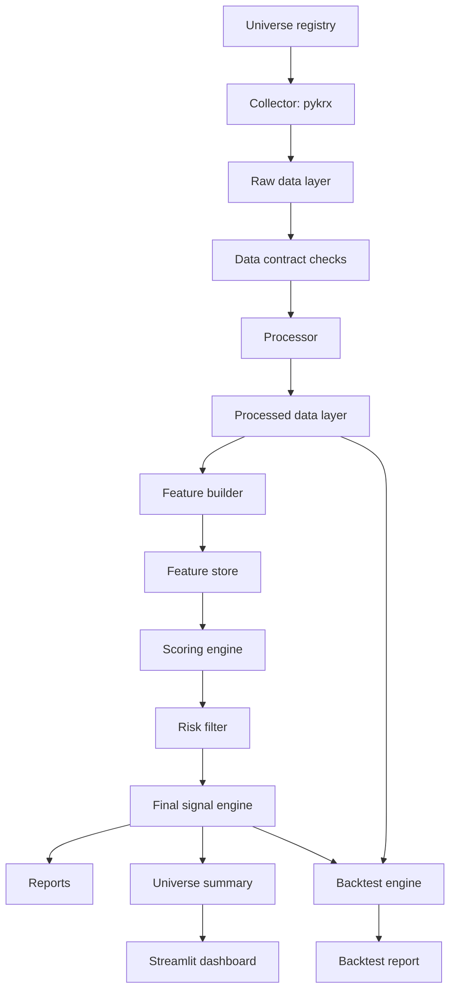

# Architecture

## Goal

KRX Alpha Platform is designed as an explainable decision-support system for
Korean equities. The platform prioritizes reproducible data pipelines, risk
control, and human review over direct price prediction.

## System Diagram



## Module Responsibilities

| Module | Responsibility |
| --- | --- |
| `collectors` | Collect raw source data from APIs or libraries. |
| `processors` | Clean raw data and create processed datasets. |
| `features` | Build reusable features for scoring and models. |
| `contracts` | Validate schemas, required columns, ranges, and duplicates. |
| `scoring` | Generate explainable technical and risk scores. |
| `risk` | Block or reduce signals when risk conditions are weak. |
| `signals` | Convert scores into final actions. |
| `backtest` | Validate historical signal behavior with cost and slippage assumptions. |
| `universe` | Manage named ticker lists for repeatable screening. |
| `reports` | Generate Markdown reports for human review. |
| `dashboard` | Display results through Streamlit. |
| `pipelines` | Orchestrate single-stock and universe workflows. |

## Why This Architecture

The project uses explicit data layers because financial systems need traceable
inputs and outputs. Each layer is saved separately so bugs can be isolated:

```text
universe -> raw -> processed -> features -> scores -> final signals -> reports/backtest
```

This separation helps avoid data leakage during backtesting and prepares the
project for walk-forward machine learning validation later.
